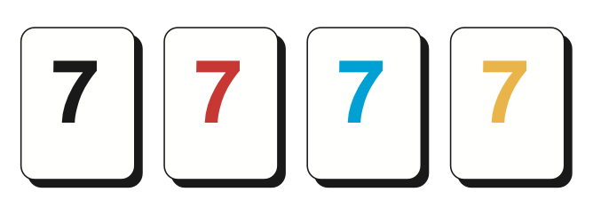

We often play games as a family, which invariably leads to some, ahem,
*discussions* about the exact rules of the game. Or we simply forget the
rules of a game.

This repo will archive the rules to some games that we enjoy playing at
home.

# Board Games

## Blokus

# Card Games

# Dice Games

# Tile-Based Games

## Rummikub

### Object of The Game

To be the first player to play all the tiles from your rack by forming
them into sets (runs and/or groups).

A **group** is a set of either three or four tiles of the same number in
different colors.

A **run** is a set of three or more consecutive numbers all in the same
color. The number 1 is always played as the lowest number, it cannot
follow the number 13.

### Setup

### Source

[How To Play - Rummikub](https://rummikub.com/rules/)

# Sources and Inspiration

This repo is inspired by [benjisimon/offline-games: Rules and tips for
offline games](https://github.com/benjisimon/offline-games)
