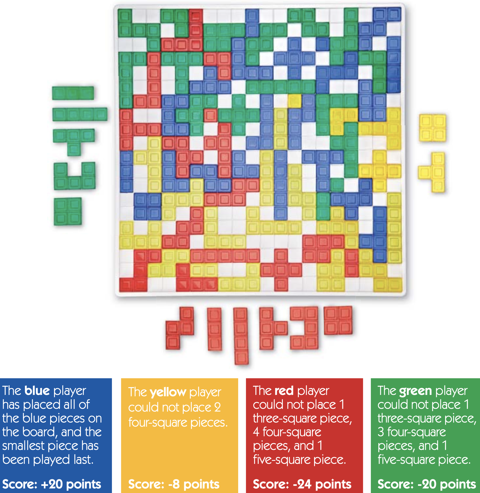
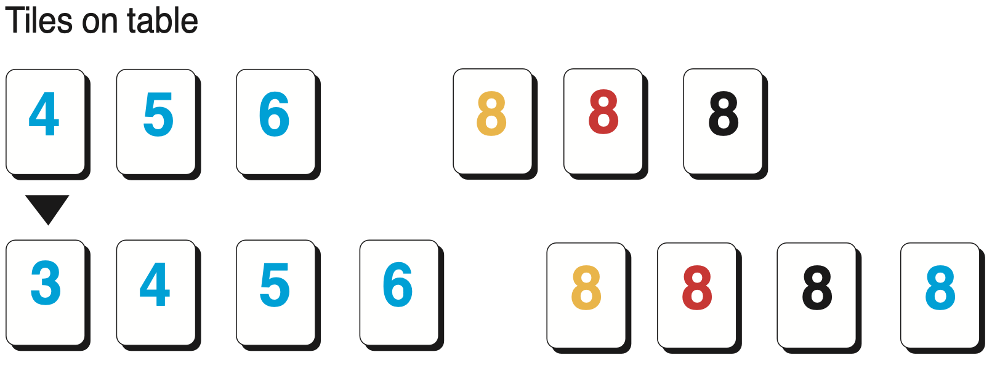

We often play games as a family, which invariably leads to some, ahem,
*discussions* about the exact rules of the game. Or we simply forget the
rules of a game.

This repo will archive the rules to some games that we enjoy playing at
home.

<!-- markdown-toc start - Don't edit this section. Run M-x markdown-toc-refresh-toc -->
**Table of Contents**

- [Board Games](#board-games)
    - [Blokus](#blokus)
- [Card Games](#card-games)
- [Dice Games](#dice-games)
- [Tile-Based Games](#tile-based-games)
    - [Rummikub](#rummikub)
        - [Object of The Game](#object-of-the-game)
        - [Setup](#setup)
        - [Playing the game](#playing-the-game)
        - [Manipulation](#manipulation)
            - [Add one or more tiles from rack to make new set:](#add-one-or-more-tiles-from-rack-to-make-new-set)
        - [The Joker](#the-joker)
            - [Four ways to clear the Joker](#four-ways-to-clear-the-joker)
        - [Time Limit](#time-limit)
        - [Incomplete Runs](#incomplete-runs)
        - [Winning](#winning)
        - [Scoring](#scoring)
        - [Strategy](#strategy)
        - [Source](#source)
- [Sources and Inspiration](#sources-and-inspiration)

<!-- markdown-toc end -->


# Board Games

## Blokus

### Object
Try to fit as many of your squares on the board as you can.

### Setup
Each player chooses a color and takes that set of 21 pieces.
Choose a player to go first, and play proceeds clockwise around the board.

### Gameplay
The first piece played by each player must cover a corner square.


Players take turns laying down one piece at a time. Each new piece must touch at
least one other piece of the same color, **but only at the corners**. Pieces of
the same color can **never** touch along a side.


There are no restrictions on how pieces of different colors may contact each
other.

Once a piece has been placed on the board it cannot be moved.

Whenever a player is unable to place a piece on the board, that player must pass
their turn.

The game ends when neither player can place any more pieces.

### Scoring
**Basic**: Once the game ends, players count the number of squares in their remaining
pieces. The player with the lowest number of squares wins!

**Advanced**: When you’re ready for more of a challenge, try advanced scoring – players are now competing for the highest score.
Each player counts the number of squares in their remaining pieces:
1 square = -1 point. A player earns +15 points if all of their pieces have been placed on the board plus 5 additional bonus points if the last piece they placed on the board was the smallest piece (one square).

Here’s an example of a completed game where the blue player has won.


### Variations

#### Two Players
◆ One player controls blue and red, and the other player controls yellow and green.
◆ The playing order is blue, yellow, red, green.
◆ At the end of the game, players calculate their scores by counting up the squares in both colors they control.

#### Three Players
◆ Each player chooses one color. 
◆ The playing order is blue, yellow, red, green. 
◆ The remaining color is shared, and is played alternately by each player. 
◆ Final scores are calculated in the same way as for the standard 4-player game. The score of the shared color is ignored.

# Card Games

# Dice Games

# Tile-Based Games

## Rummikub

### Object of The Game

To be the first player to play all the tiles from your rack by forming
them into sets (runs and/or groups).

A **group** is a set of either three or four tiles of the same number in
different colors.


A **run** is a set of three or more consecutive numbers all in the same
color. The number 1 is always played as the lowest number, it cannot
follow the number 13.


### Setup

Place the tiles face down on the table and mix them thoroughly. Each player picks a tile; the player with the highest number goes first. Return the tiles to the table and mix them. It is recommended to stack the tiles in piles of 7 for ease of playing. Each player takes 14 tiles and places them on his/her rack.

The remaining tiles are called the “pool.” Each round is made up of multiple games. The number of players determines the number of games in a round - with four players a round is made up of four games, with three players a round is made up of three games, and with two players a round is made up of two games. However, the players can determine the numbers of rounds. (Nevertheless - players may have their own 'house rules').

When a player plays the last tile on his/her rack a game ends. Players then start over again until they have played the number of games/rounds they agreed to play.

### Playing the game
Each tile is worth its face value (the number shown on the tile). In order to make an initial meld, each player must place tiles on the table in one or more sets that total at least 30 points. These points must come from the tiles on each player’s rack; for their initial meld, players may not use tiles already played on the table. A joker used in the initial meld scores the value of the tile it represents. 

When players cannot play any tiles from their racks, or purposely choose not to, they must draw a tile from the pool. After they draw, their turn is over. Play passes to the left (clockwise). 

On turns after a player has made his/her initial meld, that player can build onto other sets on the table with tiles from his/her rack. On any turn that a player cannot add onto another set or play a set from his/her rack, that player picks a tile from the pool and his/her turn ends. 

Players cannot lay down a tile they just drew; they must wait until their next turn to play this tile. 

Play continues until one player empties his/her rack and calls, “Rummikub!” This ends the game and players tally their points (see Scoring). If there are no more tiles in the pool but no player has emptied his/her rack, play continues until no more plays can be made. This ends the game.

### Manipulation
Players try to table the greatest amount of tiles by rearranging or adding to
sets which are already on the table. Sets can be manipulated in many ways
(examples follow) as long as at the end of each round only legitimate sets
remain and no loose tiles are left over.

#### Add one or more tiles from rack to make new set:
Tiles on rack: 

Tiles on table: 


``` 
Example 1: Blue 4,5,6 are on the table. The player adds a blue 3. The blue 8 is added to the group of 8’s already on the table.
```
TODO: add more manipulations

### The Joker
There are two jokers in the game. Each joker can be used as any tile in a set, and its number and color are that of the tile needed to complete the set. On future turns, a joker can be retrieved from a set on the table by a player who can replace it during his/her turn with any tiles that can keep the set legitimate. This tile can come from the table or from a player’s rack. In the case of a group of three tiles, the joker can be replaced by a tile of either of the missing colors. 

When a player retrieves a joker, the joker will once again have any value or color. However, a player who retrieves a joker must play the joker on his/her current turn to make a new set, and must also use at least one tile from his/her rack on that turn (just as on any other turn). A player cannot retrieve a joker before s/he has played his/her initial meld.

#### Four ways to clear the Joker
TODO: finish this section

### Time Limit
There is a time limit of 1 minute per player, per turn. Players who go over the time limit must draw a tile from the pool, ending their turns.

### Incomplete Runs
Players who cannot complete a move within the 1 minute time limit must replace the tiles that were on the table to their previous positions, take back the tiles they played, and draw 3 tiles from the pool as a penalty. This ends the turn.

### Winning
When the last round ends, the player who has won the most games in all rounds combined is the winner. In the case of a tie, the player with the highest score is the winner.

### Scoring
After a player has cleared his/her rack and called “Rummikub!”, the other players add up the value of the tiles they are holding on their racks as a negative figure and the winner of the game receives a positive score equal to the total of all the other players’ points. As an aid to checking the figures, the winner’s score should equal the total of the other players’ scores in each game and at the end of each round. 

Note: the penalty for having a joker on a rack is 30 points.

In the rare case that all the tiles in the pool are used before any player goes “Rummikub!” and no player can play any more tiles, the player with the lowest value of tiles on his/her rack wins the round. 
Each player totals up the value of his/her tiles and subtracts it from the winner’s total (this will result in a negative number for each player). They then reduce their scores by this amount. 

The total of these negative numbers is scored to the winner as a positive amount.
After scoring the game, players place all the tiles back on the table and begin the next game by following the directions under Set Up. In addition to keeping track of points, players keep track of the number of games each player has won.

TODO: add scoring table

### Strategy
The beginning of a game of Rummikub® may seem slow, but as the table builds up, more plays are possible. In the early stages of the game, it’s a good idea to hold back some tiles so that other players open up the table and provide more opportunities for play. Sometimes it is useful to hold back the fourth tile of a group or run and play only three, so that on the next turn you can play a tile instead of drawing from the pool. Keeping a joker on your rack is also a good strategy; however, you risk being caught with it (earning a penalty of 30 points) when another player goes “Rummikub!”

### Source

[How To Play - Rummikub](https://rummikub.com/rules/)

# Sources and Inspiration

This repo is inspired by [benjisimon/offline-games: Rules and tips for
offline games](https://github.com/benjisimon/offline-games)
